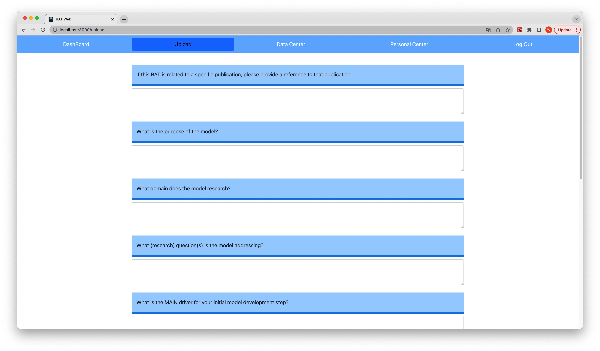
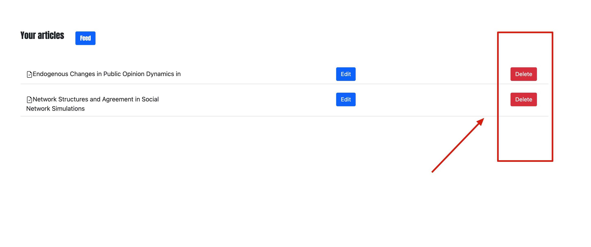

# RAT Document Data Browser User Guide

## Introduction

RAT Document Data Browser empowers users to move their data to the Internet without the limit of devices that are used. It allows people to check data with any device at anytime as long as it is connected. It opens brand new avenues for managing rat document data in ABM (Agent Based Model) field.

RAT Document Data Browser, which we name RatDB for simplicity, is intended to be flexible and provide not only all the basic functionality to allow people to easily manage data online, but also some relevant document  recommendations for them based on the previous data they uploaded.

RatDD enable you to create and share your data on the platform. When you upload data, you can choose if it can be public. On the platform, you can also have a look at other's public rat documents.


**Notes:** As the website hasn't been deployed in the Internet, so the project can only run locally now and the following instructions are only for the purpose of testing and they require some CS knowledge background. However, if you don't want to be bothered, you can just watch the video of this website in action as well. 

## Preparations

In order to run the project locally, please make sure your PC has **npm, React library, and python Django installed**, and follow the steps below.

To initialize the RatDB project:

1. Upzip the project file.

2. Open front-end file in the terminal (If your OS is Windows, it will be Command Prompt). Type 'npm start' and run to activate the front-end.

3. Open back-end file in the terminal. Type 'python manage.py runserver' and run to activate the back-end.

4. You will see a view of the website of which the url is http://localhost:3000/: 

   

5. Connect to the database. Open settings.py file in the subdirectory rat_rs under the directory back_end and change the database info to yours. 

   

   If you don't have any database software like MySQL, you can just use the embedded database of Django and reset the setting like that: 

   ```python
   DATABASES = {
       'default': {
           'ENGINE': 'django.db.backends.sqlite3',
           'NAME': BASE_DIR / 'db.sqlite3',
       }
   }
   ```

6. Visit http://127.0.0.1:8000/admin/ url via your browser, and log in the Django administration with the username `arieskoo` and the password `gw010101`. After that, add at least one user information manually. And then you are able to test the website finally. 

**Please move to Developer Guide to see more details of this project.**

## Log In

To access your data, or data to which you have permission to access, you must log in:

1. Open the browser, and visit http://localhost:3000/ url

2. Input username and password, and click 'Sign in' button.

   

3. After successfully logging in, you will see all of the data which you have read permission to.

## Log Out

To log out the account:

1. Have a look at the top right corner of the website where a 'log out' button is. 

2. Click 'Log Out' button.

   ​	

## Functionality

### Navigation

1. Click 'Personal Center', you are able to view and change your info.

   

2. Click 'Data Center', you can see how many documents you've already uploaded so far.

   

3. Click 'Upload', you will see all the questions. So you can fill the form and submit your new RAT document.

   

### Personal Center

1. Here you can change all your information when you registered for the first time.

   

2. After changing all the information, you should click the 'submit' button in order to sync the data in our database.

### Data Center

In Data Center, you can manage all the data you uploaded before. The operation includes adding, deleting, updating, etc. 

1. If you click the red 'delete' button, all the information about that paper will be deleted forever.

   

2. if you click the blue 'edit' button, it will lead you to a new page in order to edit all information of that specific paper.

   

   

3. After the operations, don't forget to click the 'submit' button.

### Recommendations

In Data Center, we can see 'Feed' button, if you already uploaded some documents, the platform can calculate and recommend you some paper here.

1. Click 'Feed' button

   

2. Wait for a while (it depends on how many documents you uploaded), you will see some recommendations.

   

   

### Upload your RAT document

In Upload section, you can upload your RAT document by filling the form.

1. Read all the questions, and answer them if neccessary. Remember you don't have to anwer all the questions.

2. After that, type your ABM paper name.

3. Finally, choose if you want to make it public. If you haven't finished, you can just publish it later. And then click 'submit' to save your file.

   

### DashBoard

So far, DashBoard can provide all the public RAT documents for every user. 

1. Click 'DashBoard' button in the top left of the browser.

2. You will see a bunch of RAT document that has been public by others and yourself.

   

3. If you click any of them, you can enter the document and see the content that the user already filled.

   

   

4. However, remember all of them are read only. So you can only have the permission to read. And also if other users change the public status of the document, you will not be able to access that again.
